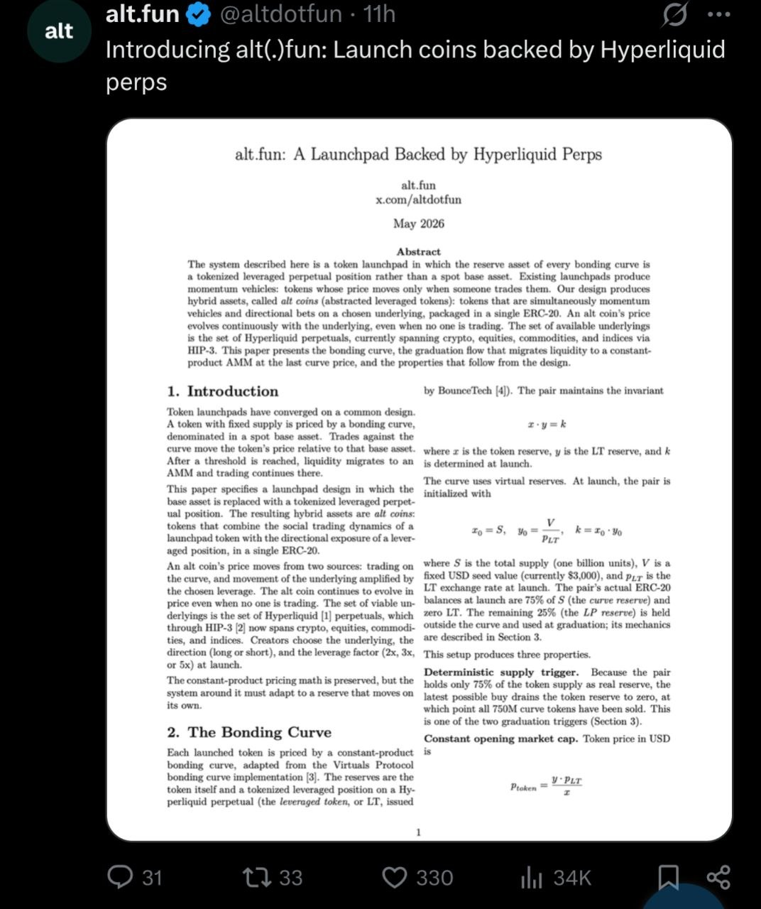

# 28-altfun-whitepaper-hyperliquid-inspo



- **Date:** 2026-05-13  •  **TG msg id:** 28
- **My caption:** CryptoCocks needs a white paper.. it should look smart like this too
- **Extracted text:**
  ```
  alt.fun @altdotfun · 11h
  Introducing alt(.)fun: Launch coins backed by Hyperliquid perps

  alt.fun: A Launchpad Backed by Hyperliquid Perps
  alt.fun
  x.com/altdotfun
  May 2026

  Abstract
  The system described here is a token launchpad in which the reserve asset of every bonding curve is
  a tokenized leveraged perpetual position rather than a spot base asset. Existing launchpads produce
  momentum vehicles: tokens whose price moves only when someone trades them. Our design produces
  hybrid assets, called alt coins (abstracted leveraged tokens): tokens that are simultaneously momentum
  vehicles and directional bets on a chosen underlying, packaged in a single ERC-20. An alt coin's price
  evolves continuously with the underlying, even when no one is trading. The set of available underlyings
  is the set of Hyperliquid perpetuals, currently spanning crypto, equities, commodities, and indices via
  HIP-3. This paper presents the bonding curve, the graduation flow that migrates liquidity to a constant-
  product AMM at the last curve price, and the properties that follow from the design.

  1. Introduction
  [Token launchpad design using tokenized leveraged perpetual positions as reserve assets...]

  2. The Bonding Curve
  [Constant-product bonding curve adapted from Virtuals Protocol; reserves are the token
  itself and a tokenized leveraged position on a Hyperliquid perpetual...]

  Math: x·y = k  (where x is token reserve, y is LT reserve, k determined at launch)
  x₀ = S,  y₀ = V/p_LT,  k = x₀·y₀
  p_token = (V·p_LT) / x

  Engagement: 31 comments · 33 retweets · 330 likes · 34K impressions
  ```
- **Summary:** A Twitter post showing the alt.fun whitepaper — an academic-style paper for a Hyperliquid-perps-backed token launchpad, complete with abstract, math notation, and section headers. The user saved it as a formatting and style reference for writing the CryptoCocks whitepaper.
- **Action / why I saved this:** Use alt.fun whitepaper layout (abstract, sections, bonding-curve math) as the template/style guide for drafting the CryptoCocks white paper.
