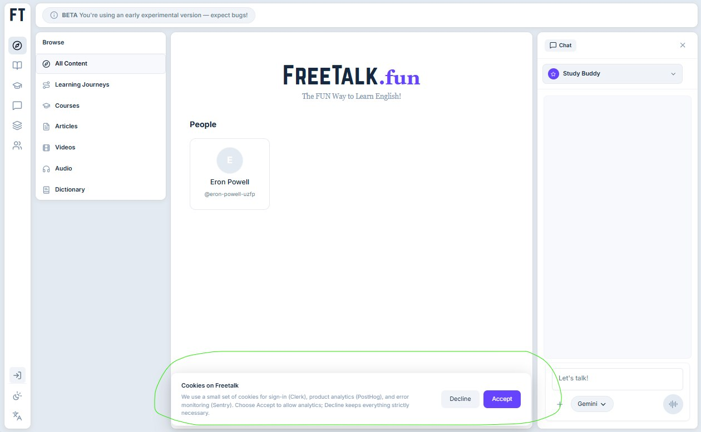

# 41-freetalk-ai-study-buddy

- **Date:** 2026-05-29  •  **TG msg id:** 41
- **My caption:** (none)
- **Extracted text:**
  FT | BETA You're using an early experimental version — expect bugs!
  Browse | All Content | Learning Journeys | Courses | Articles | Videos | Audio | Dictionary
  FreeTalk.fun — The FUN Way to Learn English!
  People
  Eron Powell @eron-powell-uzfp
  Chat | Study Buddy | Gemini | Let's talk!
  Cookies on Freetalk: We use a small set of cookies for sign-in (Clerk), product analytics (PostHog), and error monitoring (Sentry). Choose Accept to allow analytics; Decline keeps strictly necessary.
  [Decline] [Accept]
- **Summary:** FreeTalk.fun is a beta EdTech platform for English learning with AI-powered "Study Buddy" chat (Gemini), a content library (courses, videos, audio, dictionary), and social profiles; the cookie dialog (circled) reveals their tech stack: Clerk + PostHog + Sentry.
- **Action / why I saved this:** Reference for EdTech platform structure and Clerk/PostHog/Sentry stack choices in a language-learning SaaS.
