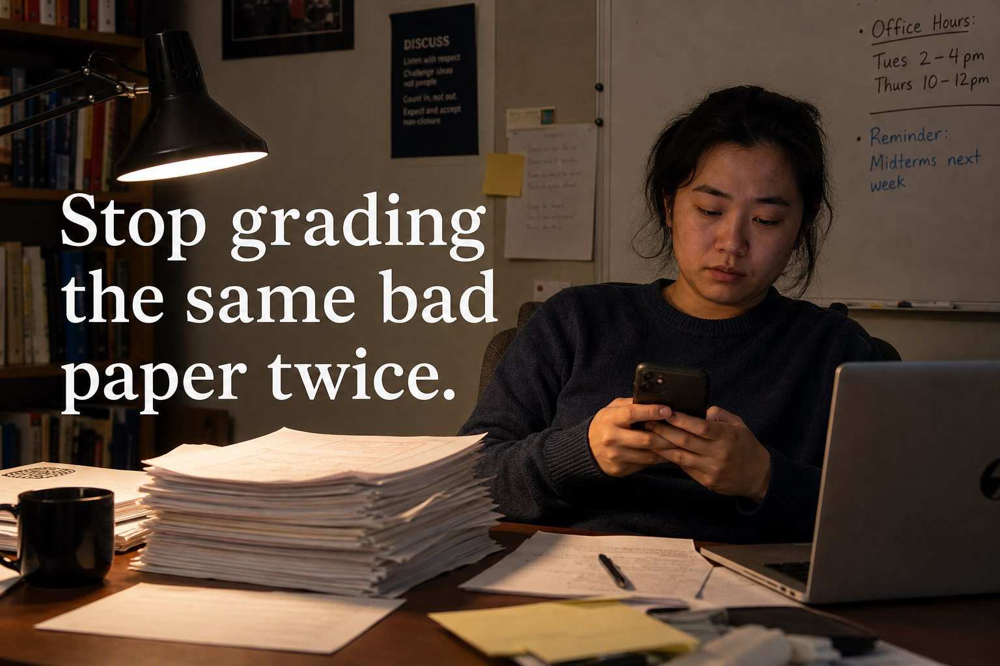

# 10-stop-grading-same-paper

- **Date:** 2026-05-09  •  **TG msg id:** 10
- **My caption:** (none)
- **Extracted text:**
  Stop grading the same bad paper twice.
  DISCUSS: Listen with respect / Challenge ideas not people / Count in, not out / Expect and accept non-closure
  Office Hours: Tues 2–4 pm  •  Thurs 10–12pm
  Reminder: Midterms next week
- **Summary:** Ad creative showing a teacher at a cluttered desk late at night checking her phone, with the bold headline "Stop grading the same bad paper twice."
- **Action / why I saved this:** Review as candidate GradeCoach ad creative — pain-point hook targeting repetitive grading frustration.
