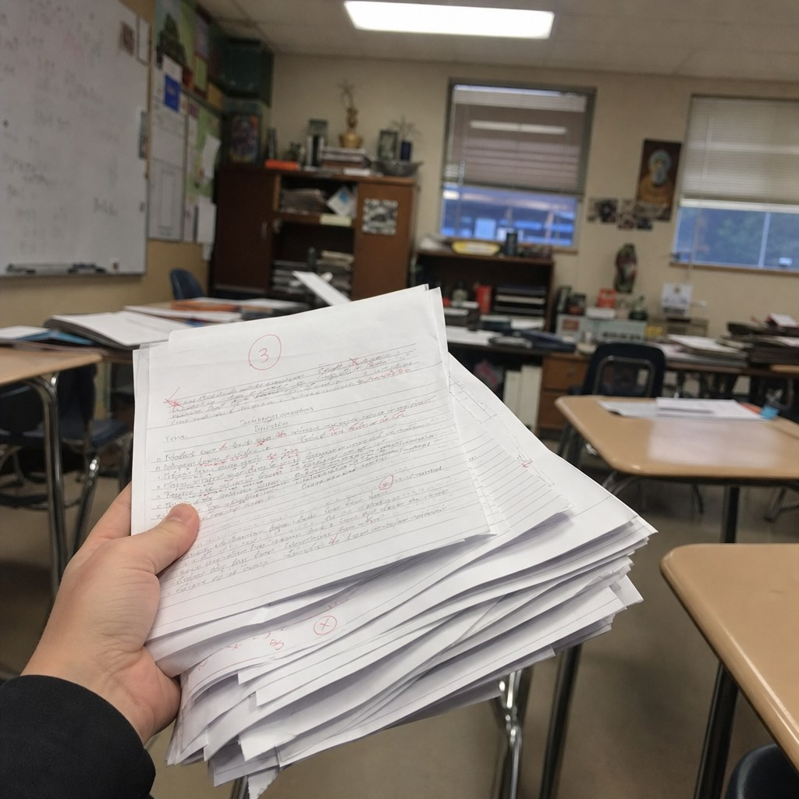

# 30-classroom-graded-essay-stack

- **Date:** 2026-05-19  •  **TG msg id:** 30
- **My caption:** (none)
- **Extracted text:**
  Circled "3" (grade) on top paper; red pen marks and corrections throughout handwritten essay pages; whiteboard visible in background classroom
- **Summary:** A hand holding a thick stack of student essays in a classroom, the top paper showing a circled grade of "3" and extensive red teacher markings — a vivid image of the manual grading burden.
- **Action / why I saved this:** Use as a "before" pain-point visual in GradeCoach ads to illustrate how much time teachers spend hand-grading.
