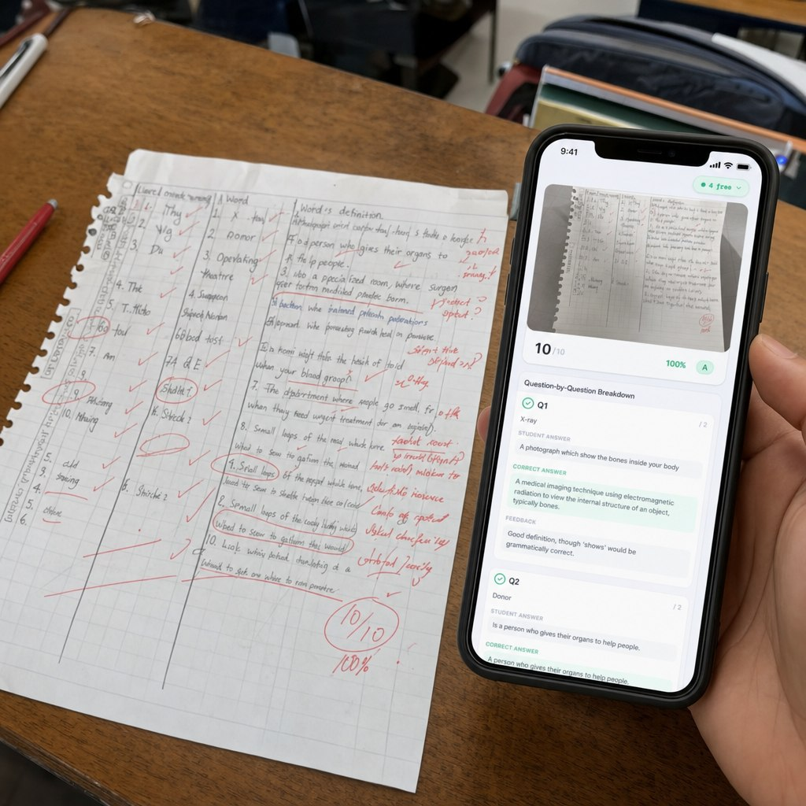

# 32-student-paper-ai-grading-app

- **Date:** 2026-05-19  •  **TG msg id:** 32
- **My caption:** (none)
- **Extracted text:**
  Phone screen: "10/10 · 100% · A"
  "Question-by-Question Breakdown"
  "Q1 X-ray /2"
  "STUDENT ANSWER: A photograph which show the bones inside your body"
  "CORRECT ANSWER: A medical imaging technique using electromagnetic radiation to view the internal structure of an object, typically bones."
  "FEEDBACK: Good definition, though 'shows' would be grammatically correct."
  "Q2 Donor"
  "STUDENT ANSWER: Is a person who gives their organs to help people."
  Paper (left): Handwritten vocabulary test on medical terms — X-ray, Donor, Operating Theatre, Surgeon, etc. — scored 10/10 100% in red pen
- **Summary:** A student's handwritten medical-vocabulary quiz scoring 10/10 sits next to a phone displaying an AI grading app that shows a question-by-question breakdown with the student's answer, correct answer, and grammar feedback.
- **Action / why I saved this:** Product-demo ad shot showing GradeCoach (or a comparable tool) in real classroom use; ideal for landing page or ad creative.
