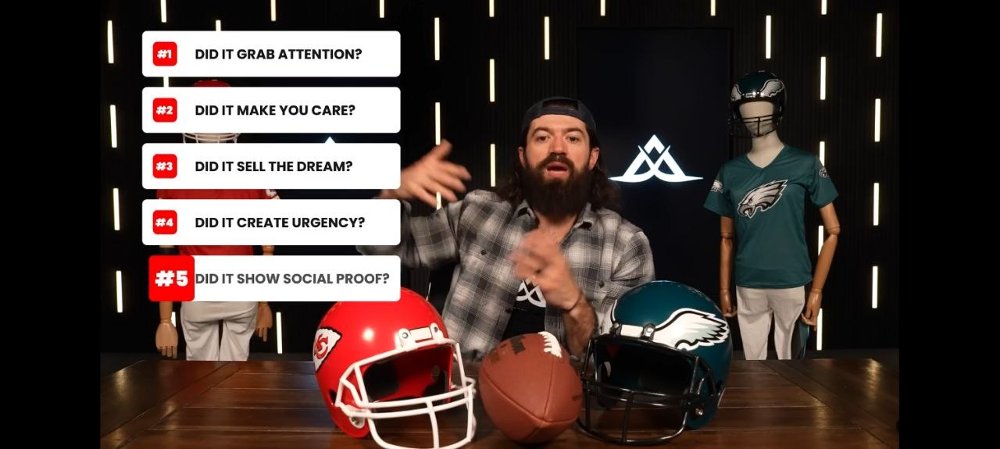

# 37-five-point-ad-checklist



- **Date:** 2026-05-24  •  **TG msg id:** 37
- **My caption:** (none)
- **Extracted text:**
  ```
  #1  DID IT GRAB ATTENTION?
  #2  DID IT MAKE YOU CARE?
  #3  DID IT SELL THE DREAM?
  #4  DID IT CREATE URGENCY?
  #5  DID IT SHOW SOCIAL PROOF?
  ```
- **Summary:** A video frame showing a bearded presenter with NFL helmets on a table, overlaid with a 5-point ad evaluation checklist covering attention, emotional hook, dream-selling, urgency, and social proof.
- **Action / why I saved this:** Use as a scoring rubric to audit or write GradeCoach ad creatives against these 5 criteria.
