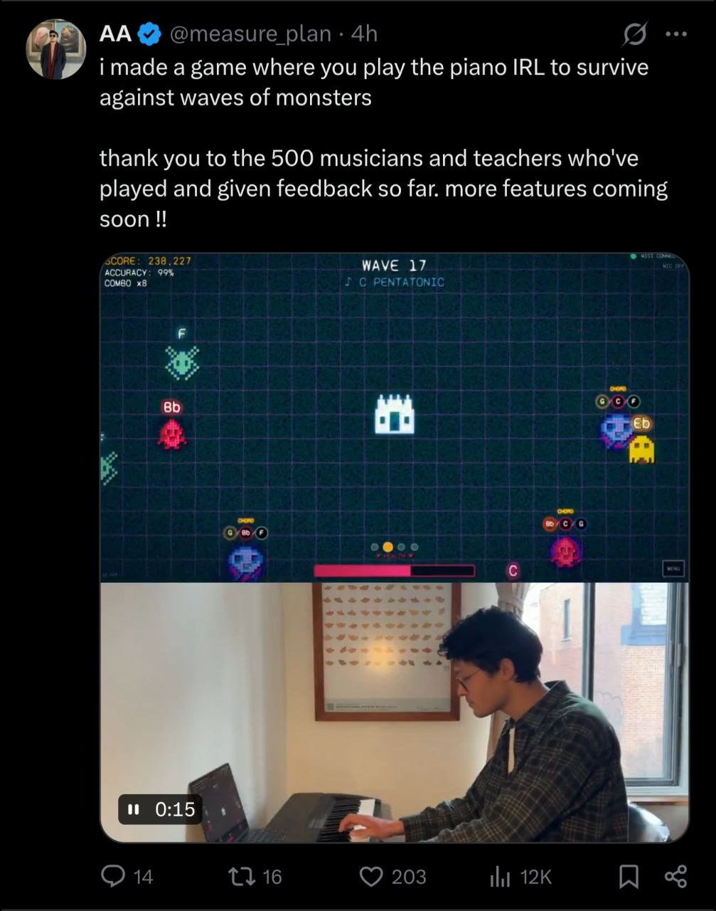

# 24-piano-irl-monster-waves

- **Date:** 2026-05-12  •  **TG msg id:** 24
- **My caption:** another good example of a mixture of sensors with a normal app... similar to the claw game image I shared before... I would like to think about how to use these ideas
- **Extracted text:**
  AA @measure_plan · 4h
  i made a game where you play the piano IRL to survive against waves of monsters
  thank you to the 500 musicians and teachers who've played and given feedback so far. more features coming soon !!
  SCORE: 238,227
  ACCURACY: 99%
  COMBO x8
  WAVE 17
  ♪ C PENTATONIC
  F  Bb  Eb  C  G  Bb/C/G  G/Bb/F
- **Summary:** A tweet showing a pixel-art wave-defense game where the player fights monsters by playing notes on a real physical piano keyboard, with a MIDI sensor bridging the instrument to the game in real time.
- **Action / why I saved this:** Explore the pattern of using a physical/IRL sensor as the input device for a digital game — apply similar "real-world controller" mechanics to a new project.
