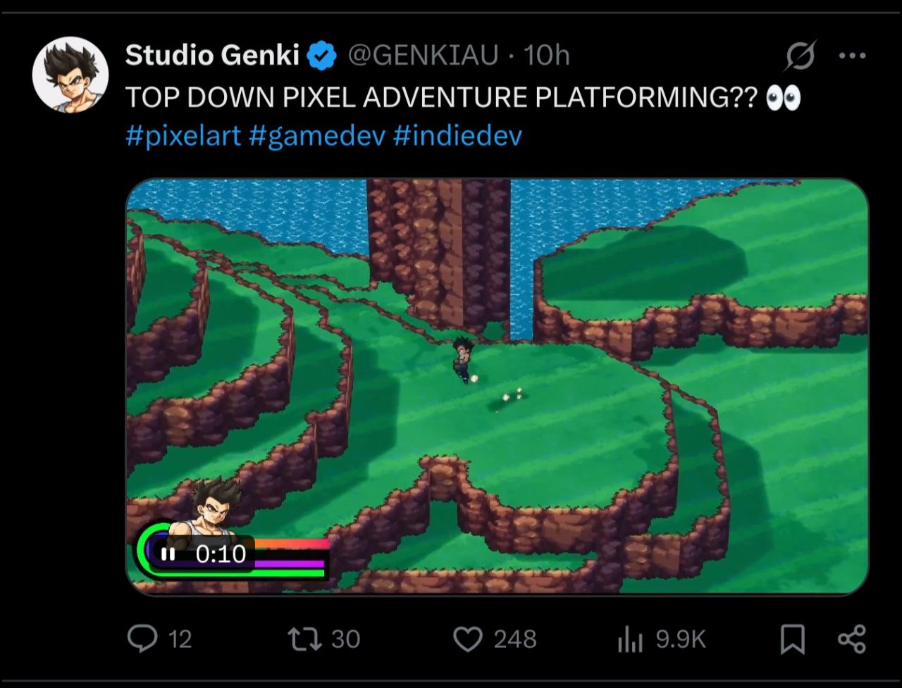

# 25-topdown-pixel-platformer-2d3d

- **Date:** 2026-05-12  •  **TG msg id:** 25
- **My caption:** this type of 2d 3d game could work for slimecrawler
- **Extracted text:**
  Studio Genki @GENKIAU · 10h
  TOP DOWN PIXEL ADVENTURE PLATFORMING?? 👀
  #pixelart #gamedev #indiedev
  0:10
- **Summary:** A tweet from Studio Genki showing a top-down isometric-style pixel art platformer with an anime character running across layered green terrain with cliffs and water, blending 2D sprite art with 3D-depth perspective.
- **Action / why I saved this:** Reference this 2D/3D top-down pixel art style as a visual and gameplay direction for the slimecrawler project.
